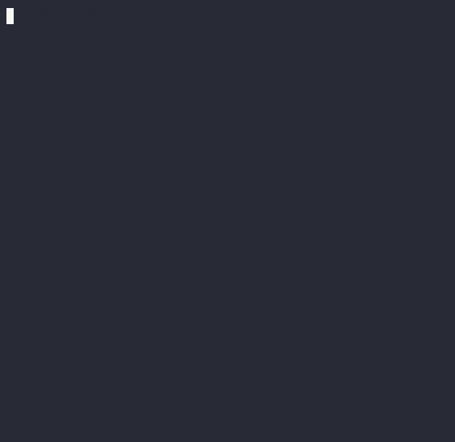

<div align="center">


# sandstorm

**Cairo prover powered by [miniSTARK](https://github.com/andrewmilson/ministark/)**

[](https://github.com/andrewmilson/sandstorm/blob/main/LICENSE)
[](https://github.com/mkenney/software-guides/blob/master/STABILITY-BADGES.md#experimental)

</div>

Sandstorm uses [miniSTARK](https://github.com/andrewmilson/ministark/) to generate [SHARP](https://starknet.io/docs/sharp.html) compatible proofs for Cairo programs ([almost](#sandstorm-sharp-differences) 😉). The prover was built by reverse engineering [StarkWare's Open-Source verifier](https://github.com/starkware-libs/starkex-contracts). Please get in touch with me at [andrew.j.milson@gmail.com](mailto:andrew.j.milson@gmail.com) if you want to fund the development of Cairo builtins, performance optimizations, full SHARP compatibility or proof recursion.

## Demo - proving Cairo programs

|  |  |
|:--:|:--:|
| *Generating the proof* | *Verifying the proof* 

In this demo, the prover has a cairo program that appears to sum the values of an array. The prover runs the program with `cairo-run` to generate `trace.bin` (stores register values at each VM cycle) and `memory.bin` (stores memory address value pairs). The prover then runs `sandstorm prove` which builds a STARK execution trace and proof from the `trace.bin`, `memory.bin` and the compiled program.


The verifier, supplied with this proof and the original code, can run `sandstorm verify` to be assert the program was executed accurately without having to run the program themselves. This is small program for demonstration purposes and it'd probably be faster for the verifier to run the program themselves. Sandstorm is capable of generating proofs for much larger programs, where verification would run orders of magnitude faster than running the program. To run this demo locally:

```bash
# 1. (optional) Install Cairo and activate the venv
# https://www.cairo-lang.org/docs/quickstart.html
source ~/cairo_venv/bin/activate

# 2. (optional) Compile and run the Cairo program
cairo-compile array-sum.cairo --output array-sum.json
cairo-run --program array-sum.json \
          --trace_file trace.bin \
          --memory_file memory.bin

# 3. generate the proof
# use `-F parallel,asm` if not using an M1 Mac
# make sure latest macOS is installed
cargo +nightly run -r -F gpu,parallel,asm -- \
    prove --program array-sum.json \
          --trace trace.bin \
          --memory memory.bin \
          --output array-sum.proof

# 4. verify the proof
cargo +nightly run -r -F parallel,asm -- \
    verify --program array-sum.json \
           --proof array-sum.proof
```

<h2 id="sandstorm-sharp-differences">Differences between Sandstorm and SHARP</h2>


Sandstorm implements a subset of the constraints and trace layout that's used by [StarkWare's STARK prover (SHARP)](https://starknet.io/docs/sharp.html). This subset contains all of all constraints outlined in the Cairo whitepaper (section 9.10) and charachterises the constraints required to prove correct execution of Cairo programs (no builtins... yet). Sandstorm has a different proof serialization format and calculates verifier randomness differently. These need to be the same to allow users to submit a Sandstorm generated proof to StarkWare's Ethereum STARK verifier (coming soon). 

## How Sandstorm works

Those curious about the inner workings of Sandstorm works can read the comments in [air.rs](src/air.rs#L115). The comments expect some understanding of how STARK proofs are generated - if you need some background on this then [Anatomy of a STARK (part 4)](https://aszepieniec.github.io/stark-anatomy/) by [Alan Szepieniec](https://twitter.com/aszepieniec) is a great resource. Also the pseudo code in section 4.5 of the [Cairo whitepaper](https://eprint.iacr.org/2021/1063.pdf) provides a nice high level overview of how some pieces fit together.